# 向量化终局架构设计

> 版本：v2.1 · 2026-08-03 · 专长模块阶段收口回顾 + CI/CD 落地 + 全类目实况同步
> 状态：法术模块 ✅ v1.0（tag `spell-module-v1.0-20260730`）；专长模块 ✅ 阶段收口（6022 chunks、召回 100%、CI 闸口落地）；装备/怪物待接入
> 前置阅读：`docs/WORKFLOW.md`、`docs/专长/专长模块开工前_流程抽象与预防清单.md`、`docs/已知问题记录.md`（KN 全量）
> 历史版本：v2.0（2026-07-30，法术模块落地回顾 + 专长接入基线）；v1.5（2026-07-24，职业模块经验抽象 + Prepare Phase 设计）

---

## 1. 概述

### 1.1 背景

- **职业模块（V001~V009 ✅）**：4112 行单文件 9 轮迭代，沉淀 5 类 Processor、9 个 SourceProvider、27 种 subtype、5 个闭环 bug + 5 个 KN。经验编码为本文档 v1.5。
- **法术模块（V010~ + KN001~KN024 ✅）**：按 v1.5 架构落地 `vectorizer/` 包，产出 4200 chunks（4199 spell + 1 spell_index）、15 字段元数据 + field_status 三态；KN001~018 全部修复并历经 5 轮审计闭环，KN019~024 登记；职业法术列表召回验收 258/259 = 99.6%；pytest 264 通过。
- **专长模块（✅ 阶段收口 2026-08-03）**：第二个完整类目接入，6022 chunks（feat 4093 / feat_index 1871 / feat_intro 58）、pytest 530、verify 5/5、召回 100%（1061/1061）、KN076~095 全闭环、CI/CD 质量闸口落地（`.github/workflows/ci.yml`）。开工依据 `docs/专长/专长模块开工前_流程抽象与预防清单.md`。

v2.0 的定位：把法术模块的**实测结果**回写为架构约束——哪些 v1.5 设计被验证有效、哪些落地时变形、哪些教训（KN/审计返工）应固化为新模块开工标准。

v2.1 的定位：把专长模块收口后的**全类目实况**回写——v2.0 中「专长接入时」的占位标记（○）全部转为 ✅ 实况；一处设计预期走了等价变体（registry 拆包 → 独立 registry_feat.py），一处补全（regen 单入口脚本 8-01 已建、8-03 CI 闸口落地后补齐其后处理链），如实登记。

### 1.2 设计原则

1. **Bug 驱动设计**：每一项架构决策都对应至少一个已发生的 bug
2. **类目无关的壳 + 类目特定的插件**：框架层不做任何职业/法术/专长假设
3. **TDD 先行**：新模块从测试开始，测试即文档
4. **门禁 + 审计**：处理前诊断（源文件能不能处理），处理后审计（chunk 对不对）
5. ~~推迟原则~~ → **触发执行**：CategoryPipeline 剩余抽象（registry 拆包、audit Tier 2 泛化）在专长接入时执行——实际走了两条等价变体：registry 不拆包（法术冻结），改**独立 `registry_feat.py`**；Tier 2 机制层泛化（`tier2_rules` 声明式注入），规则键泛化登记为债（§8）
6. **开工前补丁包原则**（v2.0 新增）：基线快照、regen 单入口、verify/audit 同口径、豁免程序、复算命令红线等 8 项流程补丁在新模块开工时一次配齐，不走法术"事后逐轮补"的老路（§6.4）

### 1.3 项目目录结构（2026-07-30 实况）

```
pf_agent/（Git 根，远程 github.com:ytche/pf_agent）
├── CLAUDE.md / PROJECT_HANDOVER.md / README.md
├── .github/workflows/ci.yml              # CI 质量闸口（专长链路，2026-08-03 起）
└── pf_data/phase1/
    ├── docs/                              # 所有设计/规划/复盘文档
    │   ├── WORKFLOW.md                    #   V/N 迭代工作流（类目无关，v2.1）
    │   ├── VECTORIZER_ARCHITECTURE_DESIGN.md  # 本文件
    │   ├── 专长模块开工前_流程抽象与预防清单.md   # 专长开工基线（v2.0 配套）
    │   ├── 流程教训沉淀.md                 # 跨模块可复用教训（v2.1 新增，专长复盘）
    │   ├── 已知问题记录.md                  # KN 全量（KN001~095+）
    │   ├── 法术KN011-018统一修复_*.md        # 交接/审计/返工 14 份（闭环协议实例）
    │   ├── 法术元数据设计.md / 法术元数据改造_交付文档.md
    │   ├── 专长/                           # 专长模块全套（元数据设计/审计交接/收口结论）
    │   └── state/                         # 登记物落仓库（k019_roman_ids.txt、开工基线）
    │
    ├── vectorizer/                        # 向量化包（法术/专长已落地）
    │   ├── pipeline.py                    #   编排器（类目无关，--category 查注册表；finalize 阶段内建，决策 A）
    │   ├── postprocess/feat_chain.py      #   专长后处理链四步骤（finalize 执行，决策 A）
    │   ├── cicd/                          #   cicd verify 统一验证链（决策 B）+ 类目装配表
    │   ├── diagnostics.py                 #   源文件质量门（ERROR 阻断 / WARN 放行）
    │   ├── audit.py                       #   审计引擎 Tier 1~3（Tier 2 已声明式注入化）
    │   ├── registry.py                    #   法术字段注册表（冻结，不拆包）
    │   ├── registry_feat.py               #   专长注册表（独立文件，v2.1 实况）
    │   ├── formats/ (base.py, spell.py, feat.py)   # 类目格式规则（职业未迁入，冻结）
    │   ├── processors/ (base.py, spell.py, feat.py) # Processor 注册表
    │   ├── sources/providers.py           #   通用 SourceProvider 链
    │   ├── config/                        #   白名单 JSON（spell_*、feat_*）
    │   ├── tests/                         #   TDD A~G 七类 + 类目专属（530 通过）
    │   ├── verify/                        #   集成验收（verify_spells.py、verify_feats.py）
    │   └── exploration/<类目>/             #   Prepare Phase 4 产出物（一次生成固定复用）
    │
    ├── regen_feat_chunks.sh               # 专长重生成+验证单入口（薄封装 cicd verify，决策 B）
    ├── regen_spell_chunks.sh              # 法术重生成单入口（冻结模块，红线：重生成必走此）
    ├── verify_spell_list_recall.py        # 法术列表召回验收（随机抽样+质量旗标）
    ├── verify_data_invariants.py          # 数据不变量闸口（CI 使用：空 text/超大 chunk/总数护栏/来源书终态）
    │
    ├── pf_rules_md/                       # 源数据：原始 CHM 转换产物（只读）
    ├── pf_rules_md_organized/             # 整理后规则书
    │   ├── 职业/（✅ 冻结）法术/（✅）专长/（✅ 收口）
    │
    └── vectorizer/output/<类目>/           # chunks.jsonl（gitignored）
```

**核心规则**（不变）：
- 源数据 `pf_rules_md*/` 只读；要改按 source_spec 走"改源数据"决策
- 数据产物不入 Git；每阶段完成 `git commit` 保持可回滚基线
- 大改动开工前打 tag（先例：`pre-normalization-baseline`、`pre-kn011-018-unified-20260729`）

---

## 2. 终局架构

### 2.1 包结构（法术落地实况 + 专长接入点）

```
vectorizer/
├── pipeline.py           # ✅ 类目无关编排（--category → PROCESSOR_REGISTRY → 单 Processor；finalize 阶段内建，决策 A）
├── postprocess/feat_chain.py  # ✅ 专长后处理链四步骤类（finalize 执行，决策 A）
├── cicd/                 # ✅ cicd verify 统一验证链（决策 B：__main__ 子命令 + verify.py 类目装配表）
├── diagnostics.py        # ✅ 规则注册表 + ERROR/WARN 两级（3 条内置通用规则）
├── audit.py              # ✅ Tier 1/3 通用；Tier 2 已声明式注入化（tier2_rules 由调用方传）
│                         #   ⚠️ 规则键仍为法术语义（min_spells_per_book 等）且暂无注入方 → §8 债
├── registry.py           # ✅ 法术字段注册表（15 字段/标签别名/学派白名单）——冻结，不拆包
├── registry_feat.py      # ✅ 专长独立注册表（FEAT_TYPE_NORMALIZE 枚举 + 标签集）——v2.1 实况
│
├── formats/
│   ├── base.py           # ✅ Phase 1 normalize（纯去噪）/ Phase 2 promote 两阶段
│   ├── spell.py          # ✅ 1639 行，7 变体修复函数（法源特定，专长不可搬用）
│   └── feat.py           # ✅ 已落地（勘探簇驱动新写，FEAT_TYPE_NORMALIZE/星壳清洗等）
│
├── processors/
│   ├── base.py           # ✅ FileProcessor 模板方法：normalize→promote→split→build_chunk→resolve_source→infer_metadata
│   │                     #   + load_resources / post_process 生命周期钩子
│   ├── spell.py          # ✅ parse_fields 统一 IR + _compute_field_status 三态 + register("spell", ...)
│   └── feat.py           # ✅ 已落地：feat_type 多通道（标题行〔战斗〕主信号→字段行→正文）
│
├── sources/providers.py  # ✅ 8 个通用 Provider + 类目专属 Provider（SpellIndexProvider 范式）
│
├── tests/                # ✅ A~G 七类普适 + 类目专属（法术 264 → 专长 530，CI 产物守卫）
│   └── test_feat_*.py    # ✅ 已落地（test_feat_format / test_feat_processor）
│
└── verify/               # ✅ verify_spells.py + verify_feats.py（判别器/召回/字段健康 5 项）
```

### 2.2 数据流（v2.0 更新：红字为法术模块新增环节）

#### 流程图（标注设计来源）

蓝底 = **v1.5（职业→法术阶段）设计**；黄底 = **v2.0（法术模块落地后）新增**；紫底 = 职业起源、法术期固化。

```mermaid
flowchart TD
    A["pf_rules_md_organized/&lt;类目&gt;/ 源文件"] --> B["subagent 并发勘探<br/>格式指纹 / 陷阱清单 / 预估条目数"]
    B --> C["exploration/&lt;类目&gt;/ 4 产出物<br/>per_file.jsonl · format_clusters.md<br/>source_spec.md · test_seeds.jsonl"]
    C --> D["<b>② 元数据 schema 设计【人工确认门】</b><br/>docs/&lt;类目&gt;元数据设计.md<br/>字段表 + 三态白名单 + 枚举 + 结构化设计"]
    D --> E["<b>③ 开工前补丁包</b><br/>git tag + chunks 基线快照<br/>regen 单入口 + verify/audit 同口径"]
    E --> F["源文件规范化（按 source_spec.md）"]
    F --> G{"diagnostics.py 门禁<br/>ERROR 阻断 / WARN 放行"}
    G -->|"通过 / WARN"| I["formats Phase 1 normalize（纯去噪）"]
    I --> J["formats Phase 2 promote（结构提升）"]
    J --> K["split_into_items 条目切分"]
    K --> L["build_chunk + <b>parse_fields 统一 IR</b>"]
    L --> M["resolve_source（SourceProvider 链）"]
    M --> N["infer_metadata + <b>field_status 三态</b><br/><b>registry 字段注册表</b>"]
    N --> O["chunks.jsonl"]
    O --> P["<b>finalize 后处理链（决策 A，pipeline 内建）</b><br/>POSTPROCESSORS 声明，幂等可重跑"]
    P --> Q{"audit.py<br/>Tier 1 绝对断言 / Tier 2 声明式预期⚠️ / Tier 3 基线偏差"}
    Q --> R["<b>首轮即检三件套</b><br/>title 合法性 + 字段值健康度 + 列表召回率"]
    R --> S["verify/ 集成验收<br/>数量下限 + 枚举覆盖 + 覆盖率报告"]
    S --> T["<b>verify_&lt;类目&gt;_list_recall.py</b><br/>随机抽样召回 + KN019/020/021 质量旗标"]
    T --> U["V/N 迭代：审计-返工闭环协议<br/>KN 登记为出口"]

    classDef v15 fill:#dbeafe,stroke:#3b82f6,color:#1e3a8a
    classDef v20 fill:#fef3c7,stroke:#f59e0b,color:#78350f
    classDef mix fill:#e9d5ff,stroke:#a855f7,color:#581c87
    class A,B,C,F,G,I,J,K,M,O,S v15
    class D,E,L,N,P,R,T v20
    class Q,U mix
```



各节点设计来源明细：

| 节点 | 来源 | 溯源 |
|---|---|---|
| Prepare Phase 勘探（A→C） | v1.5 决策 17~18 | 职业 KN006~010 教训设计，法术验证（13 簇驱动 7 变体） |
| 元数据 schema 设计（D） | **v2.0 决策 29** | 法术 v0.3 返工教训，人工确认门 |
| 开工前补丁包（E） | **v2.0 决策 22~27** | 法术 5 轮审计 8 类返工模式 |
| 源文件规范化（F） | v1.5（Prepare Phase 下游链） | source_spec.md 驱动 |
| diagnostics 门禁（G） | v1.5 决策 6 | 职业 KN004/005；⚠️ 教训：告警=0 不构成可观测性 |
| normalize/promote 两阶段（I/J） | v1.5 决策 4 | 职业 001/005 |
| split_into_items（K） | 职业起源，法术大幅扩展 | 法术 KN006/008/016 边界形态 |
| parse_fields 统一 IR（L） | **v2.0 决策 21** | 法术 KN013 值吞正文 |
| resolve_source Provider 链（M） | 职业 V009 决策 9 | 职业 002/003/KN001 |
| infer_metadata + 三态 + registry（N） | **v2.0 决策 19~20** | 法术元数据改造 F1~F5、KN018 |
| 后处理链单入口（P） | **v2.0 决策 22** | 法术第 3 轮 F3-a 静默回退；专长 `regen_feat_chunks.sh`（8-01 建）后处理 Step 2 原为占位，8-03 CI 落地后补齐四后处理脚本（§4.9），本地与 CI 双入口同链路 |
| audit Tier 1~3（Q） | v1.5 决策 13~16 | Tier 2 机制已声明式注入化（tier2_rules），规则键仍为法术语义且无注入方（§6.2/§8 债） |
| 首轮即检三件套（R） | **v2.0 §6.5** | 正则缺陷类（KN014/017/020）不可预防的补救 |
| verify 集成验收（S） | 职业起源 + 法术扩展 | 白名单清零机制、覆盖率非阻断报告 |
| 随机抽样召回（T） | **v2.0 决策 28** | 法术 258/259 验收范式 |
| 审计-返工闭环 + KN 登记（U） | 职业起源（KN 机制），法术期固化为完整协议 | KN011~018 五轮实战 |

#### 文字版数据流


```
Prepare Phase（一次性，每模块跑一次）
  3 维度勘探 → exploration/<类目>/ 4 产出物（结果固定，不进热路径）
  │
  ▼
元数据 schema 设计（v2.0 新增，人工确认门）
  基于勘探的字段标签清单/类型标记分布/字段形态统计，产出 docs/<类目>元数据设计.md
  （字段表 + field_status 三态白名单 + 枚举白名单 + 结构化字段设计）
  ※ 必须人工确认后方可进入实现——法术教训：v0.3 返工源于 schema 首跑前凭少量样本定稿
  │
  ▼
开工前补丁包（v2.0 新增，§6.4）：git tag + chunks 基线快照 + regen 单入口 + 同口径验收脚本
  │
  ▼
源文件规范化（按 source_spec.md，一次性）
  │
  ▼
diagnostics.py 门禁 → pipeline.py（normalize → promote → split → build_chunk → resolve_source → infer_metadata）
  │
  ▼
chunks.jsonl + 后处理链（如 link_mythic_base_spells.py / 专长四后处理脚本）
  │   ※ 重生成必须走 regen_<类目>_chunks.sh 单入口（覆盖后处理产物 = 静默回退，第 3 轮审计 F3-a）；
  │      专长双入口同链路：regen_feat_chunks.sh（8-01，Step 2 已补四后处理脚本）+ CI 闸口（8-03，§4.9）
  ▼
audit.py（Tier 1 绝对断言 / Tier 2 声明式预期 / Tier 3 基线偏差）
  │
  ▼
产出后首轮即检三件套（v2.0 新增，§6.5）：title 合法性 + 字段值健康度 + 列表召回率
  │
  ▼
verify/ 集成验收 + verify_<类目>_list_recall.py 随机抽样召回验收
```

---

## 3. 设计决策清单

### v1.5 决策（1~18，法术模块验证结论）

| # | 决策 | 验证结论 |
|---|------|---------|
| 1~3 | 范围决策（职业暂停/重构记账/新模块按本文档） | ✅ 执行，法术模块按本文档搭建 |
| 4 | formats 两阶段 normalize/promote | ✅ 落地有效，7 种法术变体全在 Phase 1 追加 |
| 5 | fixups 不变量契约 | ✅ 扩展为"含专项覆写模块改动前必须先列结构不变量"（CLAUDE.md 约束） |
| 6 | diagnostics 门禁 | ✅ 落地；⚠️ 教训：告警=0 不构成可观测性，须对已知丢弃样本验证告警可触发（第 1 轮 N4 空虚通过） |
| 7 | subtype 推断正文 fallback | ✅ 落地 |
| 8 | pipeline 类名规范化 | ✅ 落地 |
| 9 | SourceProvider 链 | ✅ 8 通用 Provider + 类目专属 Provider 范式（SpellIndexProvider） |
| 10~12 | TDD 试点 + 6 类普适测试 | ✅ 264 测试；test_seeds.jsonl 数据驱动有效 |
| 13~16 | 三级审计 Tier 1~3 | ✅ Tier 1/3 通用性验证；⚠️ Tier 2 键名硬编码法术概念，未做到"类目无关注入"，记入 §8 债 |
| 17~18 | Prepare Phase | ✅ **最关键验证**：法术首跑 KN006~010（5 个格式变体团灭）正是"只看 3~5 个文件写代码"的代价；Prepare Phase 后 13 簇驱动 7 变体一次覆盖 |

### v2.0 新增决策（19~28，法术模块 KN/审计教训固化）

| # | 决策 | 类别 | 溯源 |
|---|------|------|------|
| 19 | **field_status 三态**（parsed/missing/not_applicable）为所有类目元数据标准；空值必须区分"没解析到"与"本就不适用" | 架构 | KN018（530 显式否定误判 missing） |
| 20 | **registry 字段注册表模式**：CANONICAL_FIELDS + FIELD_LABEL_ALIASES + LABEL_TO_KEY（长标签优先排序防正则交替误匹配）+ 白名单 JSON 未知值保留原文 | 架构 | 法术元数据改造 F1~F5 |
| 21 | **parse_fields 统一 IR**：formats 层负责把字段归一化为 `**标签：** 值`，processors 层用统一算法解析；值边界 = 下一标签/空行/文末 | 架构 | KN013（值吞正文） |
| 22 | **后处理链单入口**：任何重生成必须走 `regen_<类目>_chunks.sh`（重生成→后处理→pytest→verify），禁止绕过 | 流程 | 第 3 轮审计 F3-a（253 链接被重生成静默清掉） |
| 23 | **开工先存基线**：chunks.jsonl 备份 + git tag，回归判定用 chunk 级 diff（消失/新增/干净→脏/脏→干净四类） | 流程 | 第 1~2 轮（160 回归无法 diff） |
| 24 | **verify/audit 同口径**：执行方与审计方共用同一口径脚本；交付文档每个 ✅ 附复算命令，跑不出就停，禁止手填 | 流程 | 第 2 轮口径偷换、每轮 4~6 项交付失实 |
| 25 | **豁免程序**：先立定性标准再豁免，逐项 chunk_id+值+理由书面申请，禁止 ℹ️ 自行放行 | 流程 | 第 4 轮（26 真吞洗白 16） |
| 26 | **交接清单机检**：条数 vs 计数一致；登记物禁引 /tmp，落 `docs/state/`；改完文档裸模式 grep 旧数字 | 流程 | 第 4~5 轮（19 写 20、/tmp 清单、69/20 残留） |
| 27 | **宽启发式开工即扫**：新模块开工即跑标题形态/粘连/结构缺失/特殊标记/列表对账五合一扫描（详见专长清单 §二） | 流程 | KN019 三轮扩编（44 罗马数字 + 23 D 类共同盲区） |
| 28 | **召回验收为标准交付物**：每类目建立权威清单（职业法术列表/专长汇总表），产出后跑随机抽样召回（seed 固定 + 别名索引 + KN019/020/021 质量旗标） | 流程 | KN016/017/022 发现手段 + 258/259 验收范式 |
| 29 | **元数据 schema 设计为独立阶段**：Prepare Phase 之后、pipeline 之前，基于勘探的字段标签清单/类型标记分布/字段形态统计产出 `<类目>元数据设计.md`，**人工确认后方可实现**；schema 即测试断言（test_<类目>_metadata 直接断言字段表） | 流程 | 法术 v0.3 返工（首跑前凭少量样本定稿，KN 修复后再改造一轮） |

> **v2.1 执行记录（专长收口后）**：决策 22 以双重入口落地——`regen_feat_chunks.sh`（8-01 建，Step 2 补四后处理脚本）+ CI 闸口（8-03，§4.9）；决策 23/24/25/26/27/28/29 全部按原设计执行——专长开工前补丁包配齐（基线 tag `pre-feat-prepare-*` + 勘探四产出物）、元数据 schema 经 k2.7 人工门（`docs/专长/专长元数据设计.md`）、t63 三闸口固化（`t63_census_audit` / `t63_firstlast_check` / `t63_phantom_forensics`）、召回验收 1061/1061=100%。决策 19~21（三态/registry/parse_fields）以 `registry_feat.py` 落地（法术 registry 冻结不拆包）。

---

## 4. 模块设计

### 4.1 `formats/` — 两阶段（决策 4，✅ 验证）

Phase 1 normalize 纯去噪（不产生新 `##`），Phase 2 promote 结构提升。新格式变体只追加 Phase 1 规则。法术 7 变体修复函数（`_fix_inline_compact`/`_fix_split_titles` 等）全部是法术源数据特定缺陷的解法，**不可搬用到专长**——专长按其勘探簇新写（v2.1 实况：`feat.py` 独立实现，含 `FEAT_TYPE_NORMALIZE` 类型枚举、星壳残留清洗 `_RE_STRIKE_SHELL` 等专长专属规则，与法术零共用变体函数）。

### 4.2 `fixups/` — 不变量契约（决策 5，✅ 验证并扩展）

扩展为通用约束：**修改任何含专项覆写的处理模块前，必须先列结构不变量清单（heading 层级/chunk 边界/归属/来源书），verify 中对每条有断言；negative test（不该出现的 chunk 没出现）同样必要**。chunk 级"OK 数合理"不构成验证。

### 4.3 `diagnostics.py` — 质量门（决策 6，✅ 验证 + 教训）

规则注册表 + ERROR 阻断 / WARN 放行。**教训（v2.0 补）**：告警机制本身必须被验证——用已知应触发样本回放，确认告警可触发，"0 warnings"才有意义（第 1 轮 N4：告警 0 ✅ 但真实丢弃未触发告警）。

### 4.4 Prepare Phase（决策 17~18，✅ 最关键验证）

3 维度 × 4 产出物框架不变（v1.5 §4.4 全文有效，此处不重复）。v2.0 补充法术实测：

- 法术首跑 KN006~010 五个"提取数≈0"全部源于"只看 3~5 个典型文件写 formats"——Prepare Phase 是对此的结构性解法
- 法术聚出 **13 格式簇**驱动 7 变体实现；专长 62+ 文件簇数预计不少于法术
- v2.0 增强：勘探时**并入五合一预防扫描**（专长清单 §二），一次跑完格式指纹 + 历史 KN 同类模式机检
- 下游衔接链不变：source_spec → 改源文件；format_clusters + test_seeds → TDD；per_file.jsonl → 运行时偏差告警 + Tier 3 基线 + 逐文件断言

### 4.5 `processors/` — 推断多通道（决策 7，✅ 验证）

breadcrumb → 正文关键词 → null（confidence: None）三通道模式不变。**专长差异点（v2.0）**：feat_type 的主信号在**标题行括号**（`猛力攻击（Power Attack）〔战斗〕`）而非字段行——与法术 school（字段行 `**学派：**`）提取位置不同，需多通道 fallback：标题行 → 字段行 → 正文。**v2.2 更新（2026-08-05）**：`processors/base.py` 新增 `entity_name_resolvers` 机制（B2）——类目可注册有序 entity name 判定链，首个非 None 结果生效，默认空列表 = title 兜底；spell/feat 未注册，行为不变。

### 4.6 `pipeline.py` — 编排（决策 8，✅ 验证）

类目无关编排验证通过：`--category` → 注册表 → 单 Processor → diagnostics 门禁 → 逐文件 process → post_process → chunks.jsonl。专长接入零编排改动，只需 `register("feat", FeatProcessor, _feat_file_condition)`。

### 4.7 `sources/` — Provider 链（决策 9，✅ 验证）

8 个通用 Provider 直接复用。法术的索引页双用途范式（SpellIndexProvider + spell_index chunk）可复用于专长汇总表（若勘探确认存在）。

### 4.8 `registry.py` — 字段注册表（决策 19~21，v2.0 新增，法术落地）

法术 Phase 3/4 核心沉淀，**模式通用、内容法术专属**：

- `CANONICAL_FIELDS`（15 字段）、`FIELD_LABEL_ALIASES`（规范 key → 中文标签变体）、`LABEL_TO_KEY` 反向映射
- **长标签优先排序**——正则交替匹配按标签长度降序，防短标签抢先误匹配（趟过的坑）
- `FIELD_STATUS_VALUES` 三态 + `_is_semantically_empty`（防空默认值误判，KN018）
- `parse_fields` 统一 IR 算法：formats 归一化 → processors 只换 LABEL_TO_KEY 即可复用
- config/ 白名单 JSON（中→英映射 + 合法值，未知值保留原文）

**v2.1 实况（等价变体）**：v2.0 原定「专长接入时拆包为 registry/spell.py + registry/feat.py + base」——实际**未拆包**：法术 `registry.py` 属已完成冻结模块（「冻结不重构」原则），专长新建独立 `registry_feat.py`（FEAT_TYPE_NORMALIZE 枚举 + 标签集），两文件并存、互不耦合。后续类目沿用「独立 registry_<类目>.py」模式，拆包方案作废。

**v2.2 决策 I（2026-08-05 设计评审）——词表安置口径**：词表 = 代码常量 + 排除理由注释（沉淀 §2.3 验证有效）；spell/feat 的 `config/*.json` 为历史形态，不强制迁移；**新模块一律内联常量**。

### 4.9 后处理链与重生成入口（决策 22，v2.0 新增；v2.1 等价变体）

法术实例 `regen_spell_chunks.sh`：重生成 → link_mythic_base_spells → VC post-process → pytest → verify，红线写入脚本头注释。**成因**：后处理产物（KN011 的 253 条 MA 链接）写在 chunks.jsonl 里，重生成会覆盖——"重生成后必须重跑全部后处理"在开工时无人负责，第 3 轮审计发现 0/253 静默回退。

**v2.1 实况（专长双入口）**：专长 `regen_feat_chunks.sh` **存在**（2026-08-01 建，R7 起生效：pipeline → 后处理 Step 2 → pytest → verify_feats）——但创建时 Step 2 为占位（「无专长后处理，跳过」），而四后处理脚本 8-03 才出现，**走 regen 脚本重生成会漏四脚本回归**（B1 教训二度发生）。8-03 CI 闸口落地（`.github/workflows/ci.yml`）后，regen 脚本 Step 2 已同步补齐四后处理脚本（apply_chm_toc_mapping → apply_feat_creation_source_promote → backfill_chm_toc_path → backfill_feat_source，顺序不可变），本地与 CI 双入口同链路。CI 闸口同时含「pytest → pipeline → 四后处理 → verify_feats → 数据不变量闸口 → 产物归档」，push/PR 自动执行（CI 不绿不合并）。⚠️ 教训：任何重生成入口（regen 脚本或 CI）都必须含四脚本，漏跑即回归，清单见 `docs/流程教训沉淀.md` B1。法术/专长（已验收模块）：保持 regen 脚本 + CI 闸口双入口，禁止再造新变体。

**v2.2 决策（2026-08-03 设计评审定稿；2026-08-03 落实范围修订——专长模块落地）——后处理内建 pipeline finalize 阶段**：专长全程暴露 B1 教训二度回归的根因是**后处理为 pipeline 外挂脚本**（全局产物改写模型与逐文件 Processor 粒度不符，`post_process` 文件级钩子不适用，发现性不足）。专长模块落地（评审结束时用户拍板：全部方案在专长落实，非「仅后续模块生效」）：

- **机制**：pipeline 编排层新增 **finalize 阶段**（chunks.jsonl 落盘后、verify 前），执行类目声明的后处理步骤链；类比构建生命周期 `compile→test→package` 内建阶段。
- **声明位置**（决策 1a）：`processors/<类目>.py` 内 `POSTPROCESSORS = [step1, step2, ...]` 有序列表，与 PROCESSOR_REGISTRY 同构就近维护；顺序即声明顺序（顺序不可变语义显式化）。
- **接口**（决策 2b）：类 + `run()`（类持映射表等资源，run 纯函数式 `(chunks_path) -> chunks_path`，幂等可重跑）。
- **三条契约**：① **幂等性硬契约**（重跑 diff 为空，pytest 幂等测试）；② **顺序显式**（有序列表，顺序敏感步骤注释「不可变」）；③ **默认关闭兼容**（已验收类目不声明 POSTPROCESSORS → pipeline 行为与现状完全一致，回归验证零变化）。
- **重生成入口**：收敛为单命令 `pipeline --category <类目>`（含 finalize），regen 脚本/CI 不再维护独立后处理步骤清单——从「编排保证链路完整」升级为「结构保证」。
- **落实**：专长四后处理脚本（apply_chm_toc_mapping → apply_feat_creation_source_promote → backfill_chm_toc_path → backfill_feat_source）迁入 pipeline finalize 阶段（POSTPROCESSORS 注册表，类 + run() 函数式接口，三条契约：幂等硬契约/顺序显式/默认关闭兼容）；法术 link_mythic 外挂为冻结模块保持不迁移（§8 债表登记）。
- **✅ 执行记录（2026-08-03，commit `3565c3c`）**：`vectorizer/postprocess/feat_chain.py` 四步骤类迁入；`FeatProcessor.POSTPROCESSORS` 声明；`pipeline._finalize()` 挂载（chunks.jsonl 落盘后、verify 前；`_load_chunks_jsonl` 重读返回最终态保证返回值与磁盘一致）；pytest 新增 `test_postprocess.py` 5 用例（幂等硬契约/终态/SKIP_DOCS 保留/默认关闭兼容/声明序匹配）；`verify_data_invariants.py` 新增来源书终态断言（book '?' ≤ 100、toc 空 = 0，前置条件 = 产物经 finalize）；根目录四脚本 git rm、regen Step 2 与 CI yml 四脚本步骤删除（结构保证替代编排保证）；回归：pytest 551 全绿、产物 diff 与迁移前完全一致、verify 5/5、召回 100%、不变量 6/6。

**v2.2 决策 B（2026-08-03 设计评审）——验证链统一编排命令**：regen 脚本与 CI yml 各写一份验证链（漂移实证：regen Step 2 占位 2 天回归窗口），且本地验收面 ≠ CI 验收面（regen 244 用例 vs CI 530 + 不变量）。后续模块设计：

- **单一编排命令** `python3 -m vectorizer.cicd verify --category <类目>`：承载完整验证链（pytest 类目收集 → pipeline 含 finalize → verify → 数据不变量），本地与 CI 同一事实源。
- **职责分工保留**：regen（薄封装/废弃）验证本地未提交改动 = 提交前自检；CI（yml 退化为 checkout + setup + 调用同一命令）验证已提交仓库状态 = 合并闸口 + artifact 归档。
- **验收面对齐**：regen 默认跑**该类目验收全量**（类目专属 + 通用层测试 + 不变量闸口），本地绿 = CI 该类目会绿，不再拿 CI 当探针；快速调试走单步（WORKFLOW 允许增量）。
- **测试收集按类目过滤**：`--category` 只收集该类目相关测试（feat = A~G 通用 140 + feat 专属 244），不跑其他模块（法术 141 属法术类目验收）。
- **落实（专长模块）**：`vectorizer/cicd/verify` 命令实现（pytest → pipeline 含 finalize → verify 公共框架 → 数据不变量），专长 regen 脚本与 CI yml 收敛为只调它；法术 regen 脚本为冻结模块保持现状（§8 债表）。
- **✅ 执行记录（2026-08-03，commit `0e82b16`）**：`vectorizer/cicd/` 包落地（`__init__` / `__main__` 子命令注册 / `verify.py` run_chain：subprocess 四步链，失败即 sys.exit，cwd 须为 phase1）；类目装配表 `CATEGORIES`（当前仅 feat：output_dir / verify_module / invariants / tests）；`regen_feat_chunks.sh` 从 79 行骨架收敛为 23 行薄封装（cd + 命令转发，零独立步骤清单）；CI yml 四脚本步骤删除、收敛为单步骤「完整验证链」+ 产物归档；pytest 新增 `test_cicd.py` 4 用例（help 退出码 / 未知类目拒绝 / 装配表条目存在性 / feat 注册）。真实链路全跑验证：555 passed（551 + test_cicd 4）→ pipeline 6022 chunks（finalize 四步统计与历史吻合：applied 1711/legacy 14/unknown_left 154、promoted 54/unresolved 8、filled 1363、source 670→1007）→ verify 5/5 → 不变量 6/6。
- **✅ 测试收集按类目过滤（2026-08-03 返工，commit `7d6096e`）**：首版实现曾跑全量 pytest（555），偏离设计 317 行「`--category` 只收集该类目相关测试」原案，评审指出后返工——装配表 feat 条目新增 `tests` glob 列表（A~G 通用 `test_category_*` + verify_base + cicd + `test_feat_*` + fc_match + per_file_chunk_counts + postprocess），`collect_test_files(category)` 展开为文件列表传给 pytest，每模式至少命中 1 文件（拼写错误收集期 ValueError 显形，防静默漏测）；TDD 新增 2 用例（glob 非空 + feat 覆盖/法术边界 negative）。回归：类目收集 **416 passed**（555 − 139 法术专属用例，spell 不混入 feat 链）→ pipeline 6022 → verify 5/5 → 不变量 6/6 → 整链退出码 0。矩阵扩展后每类目 job 只跑自身验收面（避免 N×全量放大）；法术专属测试归属法术类目验收面。

**v2.2 决策 H（2026-08-05 设计评审）——数据不变量闸口余量 WARN 机制**：自 2026-08-05 起，`vectorizer/cicd/verify.py` 在调用 `verify_data_invariants.py` 时为 book '?' 等上限类闸口追加余量打印与 WARN 阈值：任一闸口余量 <10% 即打印 WARN（不进 failures，不阻塞 CI），下一任务开工前必须登记参数审议。约定：**闸口参数只降不升**——收紧可直接执行，放宽必须经用户拍板并登记（参数与 KN 一一对应，防静默放水）。当前实况：race book '?' 2483/2483、feat book '?' 100/100，双顶格余量 0，均已触发 WARN 登记。

**v2.2 决策 D（2026-08-03 设计评审）——CI 类目参数化骨架，法术/职业补齐延后**：CI 是**全模块默认质量闸口**（§8 债表已执行项），结构必须类目参数化，禁止「每模块复制一份 CI 文件」的专长专用形态。设计定调：

- **唯一 CI 形态**：类目矩阵展开（`matrix.category`），每类目 job = `cicd verify --category <类目>`（决策 B 统一编排命令）+ 产物归档；新模块（装备/怪物）接入 = 矩阵加一行，零新 CI 文件。
- **当前矩阵仅启用 feat**：专长是唯一活跃迭代模块，闸口守「正在动的模块」。
- **法术/职业 CI 覆盖延后**：**到整个向量化工作完成后统一补齐**（法术 v1.0 已冻结收口、回归走本地 `regen_spell_chunks.sh`；职业未迁入 vectorizer 包，需先完成迁移）。现在为冻结模块补 CI 属过早投入——CI 失败面会扩大到不可快速修复的历史遗留数据。
- **落实（专长模块）**：CI yml 改造为类目矩阵骨架（`matrix.category`，当前仅 feat），job = `cicd verify --category feat` + 产物归档；专长四后处理迁入 finalize（决策 A）后 yml 不再列四脚本，消除「专长分支特判」。
- **✅ 执行记录（2026-08-03，commit `ad76aa9`）**：ci.yml 改造为 `strategy.matrix.include` 骨架（`fail-fast: false`，当前一行 `{category: feat, output_dir: ...}`），job 内全部 `${{ matrix.* }}` 变量（`--category` / artifact 名 / 归档 path），硬编码「feat/专长」清零；头部注释登记「新类目接入 = 矩阵加一行 + `cicd/verify.py` CATEGORIES 加一行，output_dir 两处必须同步」约束；artifact 命名 `${{ matrix.category }}-chunks`。结构校验：矩阵表达式全部被引用、旧硬编码路径零残留。⚠️ 设计说明：矩阵仅含「category + output_dir」两字段，验证链步骤本身仍全部由 `cicd/verify.py` Python 装配表单一驱动，yml 不再维护任何步骤清单。
- **技术债**：法术/职业 CI 未覆盖（直到全量向量化完成）——§8 债表登记。

**v2.2 决策 F（2026-08-03 设计评审）——判别器矩阵规范演进，非只读**：`fc_deviation_matrix.json` 三重身份（verify_feats 回归基线 est↔got / pipeline 扫描集合定义 feat.py `_FEAT_MATRIX_JSON` / 勘探留痕）。K5/K6 实证（2026-08-02）：源数据大规模修复（`\r` 定位符 4681 处等）后 est 语义从「勘探独立估计」改为「判别器新计数」，`update_fc_matrix_20260802.py` 一次性工具手填 AFFECTED 15 rel——**流程正确，但机制未制度化**；此前「矩阵只读 + 一切偏差走豁免」的设计有缺陷（est 失真 → 判别器回归拦截力退化，且矩阵变化无统一入口）。后续模块设计定调：

- **矩阵定位**：可演进资产，演进唯一入口 = 通用重生成脚本（如 `update_fc_matrix.py`），禁止手改 JSON。
- **重生成逻辑**：读矩阵现有 rel 集合 → 基于判别器（`fc_match.py`）对每个 rel 重新计数生成 est/got → 与当前输入文件集合对账（新增文件报出待加 rel、悬空 rel 报出待删）→ git diff 即审计痕迹（沿用 K5 先例）。
- **est 语义统一**：判别器计数（自证自检风险已接受——判别器错了 est/got 一起错；「静默丢失」拦截力 est>0 got=0 仍在）。
- **豁免机制保留且互补**：矩阵对但产出确实不行（亚产能/不可修复）→ 类目豁免登记（专长 `feat_exemptions_20260801.md` 先例），矩阵不动。
- **技术债**：专长矩阵演进仍走一次性工具（K5 先例形态，未通用化）——§8 债表登记，本次落实批次内通用化（update_fc_matrix.py）。

**✅ 决策 F 落实（2026-08-03，专长模块）**：

1. **通用重生成脚本落地** `vectorizer/exploration/专长/update_fc_matrix.py`：读矩阵 rel 集合 → 判别器全量重计数（est=got=判别器计数，per 同步）→ 悬空 rel 报出、`--scan` 报候选新增 → 默认 dry-run、`--write` 落盘（git diff 即审计痕迹）。替代并删除一次性工具 `update_fc_matrix_20260802.py`。
2. **判别器 bug 修复（自证自检风险实证第一例）**：dry-run 暴露 page_195 判别器计数 171→1——K5 修复（aa6b3ff）把 `\r` 裸断行合并为单行表「英文名+空格+中文名」形态后，`is_split_row` 的「首单元格**含**中文」闭合行判据误杀字典序单行表（每行首单元格都含中文译名）→ 整表被跳过。判据收窄为「首单元格**以中文开头**」（真断表闭合行 `| 鲨蜥流 |` 与单行表 `| Catch Off-Guard* 随手武器* |` 正确区分）。TDD 5 用例（`test_fc_match.py`）先行红灯 → 修复绿灯，全量 pytest 546。
3. **est 全量重算**：191 rel 从 K5 前口径同步为当前形态判别器口径（page_195 171→169、page_199 308→494、page_311 65→131 等），verify 新对账：静默丢失 0、非豁免 est=4774 / got=6084、**22 条亚产能 WARN 显形**（K5 前口径掩盖的差距如实呈现，如 page_552 差 14、page_556 差 12——部分为 FC-8c 星壳噪声口径，WARN 不阻断 CI）。
4. **KN096 登记**：亚产能清单与后续处置（修产出或豁免登记）见 `docs/已知问题记录.md` KN096。

**v2.2 决策 E（2026-08-03 设计评审）——verify 公共框架，禁止 copy 扩展**：`verify/` 下三个独立脚本（verify_feats 354 行 / verify_spells 149 行 / verify_kn011_018 325 行）无共享基类，load_chunks/CLI/检查框架逐文件复制（verify_spells → verify_feats 复制式隐性约定，用户评审定调「按 copy 模板扩展不可取」）。落地方案（评审拍板方案 1）：

- **公共框架** `vectorizer/verify/base.py`：`VerifyBase` 模板方法——argparse 解析公共参数（--chunks 等）→ `add_args` 类目扩展 → `prepare(args)` 类目数据载入 `self.ctx` → 顺序执行 checks 注册表 → 汇总 exit code；`checks: List[Tuple[str, Callable, str]] = [(名称, fn(chunks, ctx)->(ok, issues), 通过文案)]`；`load_chunks` 原样搬为模块级函数；`GENERIC_CHECKS` 常量（原 audit Tier 1 六条：url_in_title/unknown_placeholder/bold_mismatch/unknown_source_book/missing_category_id/empty_text，按需启用，本次专长不启用）。
- **verify_feats 迁移**：继承 VerifyBase，5 检查函数逻辑原样保留、签名统一 `(chunks, ctx)`，类目数据经 add_args+prepare 载入 ctx，加载打印移入 prepare，【1/5】序号由框架打印，通过文案进元组第三元素；DEFAULT_* 保留；load_exemptions/_EXEMPT_* 属类目逻辑留在 verify_feats；入口 `python3 -m vectorizer.verify.verify_feats` 保持可用。
- **audit.py 标记弃用**（不删除）：`Auditor` 类 docstring 加弃用标记并注释原因——pipeline 进程内第四环未接线、verify_*.py 路线被实际采用、评审定调 verify 公共框架为唯一形态、Tier 1 并入 GENERIC_CHECKS；`get_audit_rules` 接口与 spell.py 实现保留（冻结模块代码）。
- **落实**：专长模块落地（本批次）；法术/职业 verify 冻结不迁移（§8 债表）。
- **落实状态（2026-08-03）**：✅ `verify/base.py`（VerifyBase + GENERIC_CHECKS 六条）+ `verify_feats.py` 迁移 VerifyBase 完成（入口不变，输出结构一致）——pytest 530→**541**（新增 test_verify_base 11 用例）、verify 5/5 全过、数据不变量过；`audit.py` 已标记弃用（模块 docstring + Auditor 类 docstring 注释原因，代码保留）。

**v2.2 决策 G（2026-08-03 设计评审）——Prepare 工具参数化，复用方式统一**：Prepare Phase 工具资产（t63 三闸口 `t63_census_audit.py` / `t63_firstlast_check.py` / `t63_phantom_forensics.py` + 五合一扫描 + 产出即检三件套）散落在 `docs/专长/` 下：t63 为站点脚本路径写死专长（`exploration/专长`、`专长_per_file.jsonl`、STOP_CJK 含专长术语），五合一/产出即检是流程清单未固化成脚本，跨模块复用现状靠复制。落地方案（评审拍板：参数化）：

- **参数化迁移**：t63 三闸口移入 `vectorizer/prepare/` 包，路径参数化（`--category` / --merged / --source 等），专长专属常量（STOP_CJK 等）随类目注册；专长侧保留包装入口兼容历史用法。
- **流程清单固化成脚本**：五合一扫描、产出即检三件套从文档描述固化为 `vectorizer/prepare/` 下可执行脚本（title 合法性扫描 + 字段值健康度 + 列表召回率 + 新正则全量触发计数 + 高危模式 probe）。
- **落实**：专长模块落地（本批次）。

**✅ 决策 G 落实（2026-08-03，专长模块）**：

1. **t63 三闸口参数化迁入 `vectorizer/prepare/` 包**（`census.py` 逐字普查底座 / `firstlast.py` 自包含闸口 / `phantom.py` 三分类取证）：路径参数化 `--merged <per_file.jsonl>` / `--source <源根>`，默认值兼容专长历史行为；`phantom` 的 STOP_CJK/STOP_EN 专长语义表随类目注册（`categories.py`，`--category feat` 切换，新类目继承注册即复用整套闸口）；`python3 -m` 模块式运行。回归验证：新旧输出 **diff 完全等价**。
2. **docs/专长/t63_*.py 删除**（`t63_phantom_verdicts.json` 取证产物保留）；CLAUDE.md / 流程教训沉淀 C3 / 本文件路径同步；终审结论/交接/交付文档为历史验收留痕保留原样。
3. **五合一扫描参数化（2026-08-03 种族模块开工补强，原登记「不重复建脚本」因出现第二使用方而升级）**：`vectorizer/prepare/scan.py` 公共骨架（链接陷阱/断行英文名/〔〕类型标记/图片行/◎引用/表格块/标题候选/字段标签/译者行 + 基线表解析 `feat_table`/`race_overview` 两模式），类目配置（collect 策略 manifest/glob、field_labels、official_tags、baseline 表）注册于 `categories.py` 的 `scan` 键——与三闸口同模式，新类目注册即复用；`python3 -m vectorizer.prepare.scan --category <类目>` 产出写 `exploration/<类目>/`（machine_scan.jsonl + scan_report.md + audit_baseline.jsonl）。**等价性验证**：同一源数据下新骨架 vs 旧 `prepare_scan.py`（内存对账）逐字段 **0 处不一致**；专长侧 `exploration/专长/prepare_scan.py` **冻结保留**（历史产物已入库，不迁移不重跑）。**产出即检三件套已由 verify_feats 承担**（检查 2/3/4 = title 合法性 / 字段健康 / 列表召回）。
4. **勘探校验参数化（2026-08-03 种族模块开工补强）**：专长侧 `exploration/专长/verify_prepare.py`（16 键 schema / doc_role 词表 / traps 词表 / 8 项阻断检查 + 机检对账）出现第二使用方，按禁 copy 原则抽公共骨架 `vectorizer/prepare/verify.py`——检查项 1~8 阻断 + 9 对账清单全部通用，类目专属词表（doc_roles/trap_kinds/required_keys/title）注册于 `categories.py` 的 `verify_prepare` 键；`python3 -m vectorizer.prepare.verify --category <类目> [--batches N,M]` 产出 `exploration/<类目>/prepare_verify_report.md`。**族种 doc_roles 8 词表**（race_full/race_alt_traits/race_alt_inline/monster_play/overview/class_bonus/sidebar/mixed）反映种族格式簇比专长 5 词表更细；专长侧旧脚本**冻结保留**（历史产物留痕）。
5. **KN097 登记**：迁移回归发现勘探留痕漂移——per_file.jsonl（07-31 勘探产物）的 raw_example 在 K5/KN090~095 源数据修复后与当前源文失配（census phantom 78 条/44 文件）；历史终审「84 清零」为修复前口径，无矛盾；重勘探另立任务（详见 `docs/已知问题记录.md` KN097）。

---

## 5. TDD 与测试策略（✅ 验证，无结构性修改；v2.1 数字同步）

7 类普适测试（A~G：A 标题提升误判 / B 漏判 / C 结构破坏 / D 格式缺陷 / E 推断通道单一 / F 来源错标 / **G 归一化新增，专长补**）+ Prepare Phase test_seeds 双来源、测试与审计分工，v1.5 §5 全文有效。实测补充：

- `test_per_file_chunk_counts.py`（读 per_file.jsonl 逐文件断言 chunk 数）参数化后即为通用，专长已套用；**CI 环境守卫**：产物缺失时 `pytest.skip`（gitignored 产物在 CI checkout 拿不到），本地产物齐全仍全量执行
- 类目专属测试独立成文件（test_spell_metadata_v0_3 / test_feat_format / test_feat_processor）
- 测试量轨迹：职业试点 → 法术 264 → **专长 530**（TDD 8 组用例）
- **TDD 测试完整性规则**（用户钦定）：禁止因 bug 难修而修改或跳过测试；除非断言有业务逻辑错误

---

## 6. 自动化审计

### 6.1 三级流水线（✅ 验证）

L1 规则审计（Tier 1~3）→ L2 Agent 抽样 → L3 交叉验证，结构不变。

### 6.2 Tier 1~3 分层（✅ Tier 1/3 验证；Tier 2 机制泛化、键未泛化）

- Tier 1 绝对断言通用性验证通过；`missing_category_id` 半通用（硬编码 class_name/school 信号）——专长未触发此债（专长走 verify_feats 判别器 + 召回验收），仍登记
- **Tier 2 v2.1 实况**：`audit.py _run_tier2` 已改为**声明式规则注入**（`tier2_rules: Optional[Dict]` 参数，调用方传入规则集），机制层不再硬编码字段名；但规则键仍为法术语义（min_spells_per_book / required_schools / unknown_school_max_pct / empty_description_max）且**当前无任何调用方注入**（法术 verify 走 verify_spells/verify_kn011_018，专长走 verify_feats 5 项）——「类目无关引擎 + formats 注入」机制就绪，键名泛化 + 实际启用登记为 §8 债
- Tier 3 基线 locked 机制有效

### 6.3 审计-返工闭环协议（v2.0 新增，KN011~018 五轮实战固化）

法术模块把"修复-审计-返工"做成标准化多轮协议，**全部模块无关**：

- **文档三元组**：交接文档（方案）→ 审计要求（验收依据）→ 交付审计文档 + 审计报告；返工轮次加返工交接文档
- **审计方独立复算**：不采信执行方数据，审计方独立写脚本从 chunks.jsonl 重算全部指标
- **全局不变量清单**：pytest 全绿、chunk 总数轨迹、无文件特判（grep 硬编码=0）、不改的组件无 diff、chunk_id 集合稳定性
- **双向一致性核对**：登记文件 vs 实际数据双向差集为空
- **KN 登记机制**为闭环出口：决定不修的问题降级为 KN 登记（含机检口径、规模表、实样、修复方向、关联）

### 6.4 开工前补丁包（决策 22~27 的执行清单，v2.0 新增）

法术 5 轮审计的 8 类返工模式各有对应补丁，**开工前一次配齐约可省 3 轮返工**。完整表格见 `docs/专长/专长模块开工前_流程抽象与预防清单.md` §一，此处列纲：

1. 基线快照 + git tag → 2. regen 单入口 → 3. verify/audit 同口径 → 4. 豁免程序 → 5. 复算命令红线 → 6. 交接清单机检 + 裸模式 grep → 7. 宽启发式开工即扫 → 8. 告警有效性验证 + 归因必须验证 → 9. 实体枚举 `entity_enum.json` + 豁免登记

新增第 9 项（2026-08-05，B2 批次）：实体名归一不靠运行期兜底链独扛——Prepare 阶段收集该类目官方实体名全量枚举与合法非实体豁免清单，人工门确认后锁定；产出即检与 verify 据此判伪：归属字段值 ∉（枚举 ∪ 豁免）→ 报错。race 2026-08-05 已建：81 实体 + 41 豁免，位于 `pf_data/phase1/docs/种族/entity_enum.json`；`verify_races` 第 9 项检查 `check_race_name_enum` 已落地。

### 6.5 产出后首轮即检三件套（v2.0 新增）

正则缺陷类问题（KN014/017/018/020）源扫描不可见，靠三件套把发现时间压到首轮产出：

1. **title 合法性扫描**：非"中文+（English）"形态 title 全量列出
2. **字段值健康度**：值长分布/含句号数/含 `**` 残留 + field_status 诚实性抽查
3. **列表召回率**：权威清单 ↔ chunk title+aliases 一对一

外加：每条新写正则**全量触发计数 + 抽样人工裁决**（KN017 的 632 触发/622 误伤一检即出）；含高危模式位置取"链接后 N 字 probe"全库检索（KN023 口径）。

---

## 7. 跨模块泛化路径（2026-07-30 实况）

```
职业（V001~V009 ✅）
  │  沉淀：WORKFLOW.md / 5 Processor / 9 Provider / 27 subtype / 本文档 v1.5
  │
  ├─→ 法术（✅ v1.0，tag spell-module-v1.0-20260730）
  │     ├─ 沉淀：vectorizer/ 包落地 / registry 字段注册表 / field_status 三态
  │     │        parse_fields 统一 IR / Prepare Phase 验证 / 审计-返工闭环协议
  │     │        regen 单入口 / 召回验收范式 / KN001~024
  │     ├─ 4200 chunks / 15 字段 / pytest 264 / 召回 99.6%
  │     └─ 遗留：KN019 D 类 23 条（上线前 go/no-go）+ KN020~024 登记（随 KN020+ 迭代）
  │
  ├─→ 专长（✅ 阶段收口，2026-08-03，tag 见分支 feat/feat-module）
  │     ├─ 开工基线：docs/专长/专长模块开工前_流程抽象与预防清单.md（8 补丁包 + 五合一扫描 + 资产四分类）
  │     ├─ Prepare：189 份逐文件勘探（estimated 3635），三轮审计闭环（R1~R5→T1~T5→T6），
  │     │           t63 三闸口固化（census_audit / firstlast_check / phantom_forensics）
  │     ├─ 元数据 schema：docs/专长/专长元数据设计.md（k2.7 人工确认门通过）
  │     ├─ TDD：formats/feat.py + processors/feat.py（457 → 530 用例）
  │     ├─ 产出：6022 chunks（feat 4093 / feat_index 1871 / feat_intro 58）/ 186 文件
  │     │       召回 100%（1061/1061）/ verify 5/5 / book+chm_toc_path 100% 可溯源
  │     ├─ 质量闭环：KN076~095 全闭环（星壳家族 / 链接残留 / 译者吐槽 / feat_type 污染 /
  │     │           feat_intro 枚举 / KN095 裸标题吞并 75 行源数据修复）
  │     ├─ 链路：双入口同链路——regen_feat_chunks.sh（8-01 建，Step 2 已补四脚本）+ CI 闸口
  │     │           （.github/workflows/ci.yml，8-03）；四后处理脚本（apply×2 + backfill×2，
  │     │            顺序不可变）+ verify_data_invariants 不变量闸口
  │     ├─ 抽象执行：registry_feat.py 独立文件（法术 registry 冻结不拆包）；Tier 2 机制泛化键未泛化（§8）
  │     └─ 遗留：KN092/093（feat_index benefit 组装、双 chunk 去重——检索端策略已写交付文档，待后端实现）
  │
  ├─→ 种族（✅ 产出即检闭环，2026-08-04，#97~#101）
  │     ├─ 沉淀：formats/race.py（7 格式簇 A~H + 法术块字段链 I/I2/I3 簇）/ processors/race.py
  │     │        三后处理（RaceBackfillChmTocPath / RaceBackfillBookFromSource / RaceBackfillFeatSource）
  │     ├─ Prepare：112 份逐文件勘探（est 2132），三闸口 + scan/verify 参数化复用
  │     ├─ 产出：2264 chunks（11 component_type）/ verify_races 六检查 6/6 / 闸口全过
  │     │       召回 37/37 六字段全一致 / pytest 618 / est 2132 ↔ got 2264（+132 全定性）
  │     ├─ 质量闭环：KN102 字段链家族（伪条目 41→0 / split 剥星误伤豺狼人，簇 I/I2/I3 共 6 测试）
  │     ├─ 遗留：KN098（矮人汇总 29 race_spell 子串误判）、book '?' 1404（聚合目录设计保留）、
  │     │        R1~R8 产出即检遗留（见 docs/种族/产出即检_首轮_20260804.md §⑥，k3 审计输入）
  │     └─ 审计：产出即检文档 §⑦ 审计要求已立，执行留 k3/人工门
  │
  ├─→ 装备/物品（P1，待开工：建议直接复用 CI 闸口模式 + 开工前清单）
  └─→ 怪物/生物（P2，待开工）
```

### 7.1 通用层（法术验证后）

| 组件 | 状态 |
|------|------|
| WORKFLOW.md V/N 迭代（Step 0~5） | ✅ 法术二次验证，模块无关 |
| Prepare Phase 3 维度 × 4 产出物 + 格式簇聚类 | ✅ 法术验证（13 簇） |
| pipeline.py / diagnostics.py / audit.py Tier 1+3 | ✅ 类目无关 |
| processors/base.py 模板方法 + 生命周期钩子 | ✅ |
| formats/base.py 两阶段 | ✅ |
| PROCESSOR_REGISTRY 注册机制 | ✅ register + discover |
| 8 个通用 SourceProvider | ✅ |
| parse_fields 算法 + field_status 三态 + _is_semantically_empty | ✅ 换 LABEL_TO_KEY 即用 |
| 6 类 TDD + test_per_file_chunk_counts | ✅ 数据驱动通用 |
| verify 双模式（集成验收 + 随机抽样召回） | ✅ 质量旗标（KN019/020/021）通用 |
| 审计-返工闭环协议 + KN 登记机制 + regen 单入口 | ✅ 五轮实战固化（专长：regen 脚本 + CI 闸口双入口同链路） |
| CI 质量闸口（pytest → pipeline → 后处理 → verify → 不变量 → 归档） | ✅ 2026-08-03 起（专长链路），后续模块直接并入 |
| 数据不变量脚本（空 text / 超大 chunk / 总数护栏，只收窄不放宽） | ✅ `verify_data_invariants.py`（CI 使用） |

### 7.2 各类目特有层（不要泛化复制）

| 类目 | 特有概念 |
|------|---------|
| 职业 | `subtype_mapping`（27 种）、`archetype_masters`、变体主表解析 |
| 法术 | 15 字段 registry、学派/子学派/描述符白名单、7 变体修复函数、SpellIndexProvider、link_mythic_base_spells.py |
| 专长 | `FEAT_TYPE_NORMALIZE` + `config/feat_types.json`、标题行〔类型〕提取（多通道：标题→字段→正文）、prerequisites 结构化 `{raw, items}`（只做形态识别与键提取，不做语义理解）、PFS 图标元数据（`pfs_eligible` 布尔）、feat_index 双 chunk 去重（KN092/093 检索端策略） |

---

## 8. 技术债与触发时机（2026-07-30 更新）

| 债项 | 状态 | 触发时机 |
|------|------|---------|
| 职业 4112 行 → vectorizer/ 包 | ✅ 已随法术模块完成（**职业模块本身冻结未迁入**——formats/processors 下无 profession 文件，§1.3/2.1 已按实况修正） | — |
| CategoryPipeline 剩余抽象：**registry 拆包**（registry/spell.py + registry/feat.py + base） | ✅ **以等价变体关闭**：法术 registry 冻结不拆包，专长独立 `registry_feat.py`（符合「已完成模块冻结不重构」原则） | 已执行（v2.1 关闭） |
| CategoryPipeline 剩余抽象：**audit.py Tier 2 键名泛化**（规则对象化，去法术概念硬编码） | ✅ **已关闭/已完成（2026-08-05，C2 弃用收尾批次）**：audit 引擎已弃用，`formats/base.py` 的 `get_audit_rules` 改为可选钩子（默认返回 `{}`），`feat.py`/`race.py` 死实现已删除，`pipeline.py` 处理链描述已移除 audit 环节；Tier 2 规则键泛化随 audit 废弃不再推进 | — |
| **判别器矩阵演进一次性工具（v2.2 决策 F）**：专长 `update_fc_matrix_20260802.py` 手写 AFFECTED 15 rel、无对账（新增/悬空 rel 不报出）——机制正确未制度化；后续模块改通用重生成脚本（判别器重计数 + 输入集合对账 + git diff 留痕），禁止手改 JSON | ✅ **已通用化（2026-08-03，决策 F 落实）**：`update_fc_matrix.py`（dry-run/--write/--scan）替代并删除一次性工具；落地中顺带修复 is_split_row 判据过宽 bug（TDD 5 用例）并全量重算 191 rel est（详见 KN096） | 已执行 |
| 通用清洗层 markdown 链接剥离过杀（KN023，33 处截断） | ✅ 专长侧已处理（KN075 链接残留 25→0 闭环） | 已执行 |
| **CI 闸口落地为全模块默认链路** | ✅ 2026-08-03 起（`.github/workflows/ci.yml`），后续类目直接并入 | 已执行 |
| KN092/093（feat_index benefit 组装、双 chunk 去重） | 📋 登记（检索端策略已写入 `docs/专长/专长模块数据使用说明.md`，方案就绪） | 后端检索实现时 |
| KN019 D 类 23 条（核心书高频法术正文与法术名失联） | 📋 登记 | 一期上线前 go/no-go 决策点 |
| KN020/021/022/024 | 📋 登记 | 随 KN020+ 解析器迭代统一处理 |
| 职业剩余 KN（002/003/005） | 📋 登记 | 需要 subtype 过滤时 |
| **后处理外挂（v2.2 决策 A，2026-08-03 落实范围修订）**：专长四脚本链 + 法术 link_mythic 为 pipeline 外挂，链路完整性靠 regen/CI 双入口编排兜底（B1 教训二度发生）——**专长四脚本迁入 finalize（`POSTPROCESSORS`，本批次落实）**；法术 link_mythic 冻结保持外挂 | ✅ **已落实（2026-08-03）**：`vectorizer/postprocess/feat_chain.py` 四步骤类 + `FeatProcessor.POSTPROCESSORS` 声明 + `pipeline._finalize()` 挂载；幂等/终态/默认关闭 pytest 5 用例；不变量闸口新增来源书终态断言；根目录四脚本删除，regen/CI 收敛（结构保证）；回归全绿 | 已执行 |
| **验证链双份编排（v2.2 决策 B，2026-08-03 落实范围修订）**：regen 脚本 + CI yml 各写一份验证链（regen Step 3 仅 2 个 feat 测试文件 + verify_feats，无数据不变量；CI 530 全量 + 四后处理 + 不变量），本地验收面 ≠ CI 验收面，双处维护漂移风险（regen Step 2 占位 2 天回归实证）——**专长收敛 `vectorizer.cicd verify --category feat` 单入口（已落实，commit `0e82b16`：cicd 包 + regen 薄封装 + CI 单步骤，555 passed / 6022 chunks / verify 5/5 / 不变量 6/6）**；法术 regen 脚本冻结保持现状 | ✅ 已落实（专长，2026-08-03） | cicd verify 命令 + regen/CI 收敛 |
| **法术/职业 CI 未覆盖（v2.2 决策 D）**：CI 仅启用 feat 类目；法术 146 个产物级测试（per_file 5 + metadata 141）在 CI 永远 skip、职业无 CI；回归靠本地 regen 脚本——**整个向量化工作完成后统一补齐**（法术按 cicd verify 骨架挂载；职业先完成 vectorizer 包迁移再挂载），届时 CI 类目矩阵展开（matrix.category），新模块接入 = 矩阵加一行；**矩阵骨架 ✅ 已落地（2026-08-03，commit `ad76aa9`）**：yml `strategy.matrix.include`（当前仅 feat 一行）+ `cicd verify --category ${{ matrix.category }}` + artifact 按类目命名 | ⚠️ 登记（延后补齐）；骨架 ✅ 已落地 | 全量向量化完成节点；装备/怪物模块开工时矩阵加一行即接入，法术/职业随同挂载 |
| **verify 三脚本复制（v2.2 决策 E）**：verify_spells/verify_kn011_018 为复制式无公共框架（load_chunks/CLI 逐文件复制）——**专长已迁移公共框架**；法术/职业 verify 冻结不迁移 | ✅ 专长已落实（VerifyBase + GENERIC_CHECKS + audit 弃用标记 + test_verify_base 11）；法术/职业 ⚠️ 登记 | 已执行（专长） |
| **Prepare 工具散落 docs/ 未参数化（v2.2 决策 G）**：t63 三闸口站点脚本路径写死专长、五合一/产出即检为流程清单未固化——**本批次参数化迁入 vectorizer/prepare/ 并固化**（骨架通用 + 专长语义表注册；文档路径同步） | ✅ **已落实（2026-08-03）**：`vectorizer/prepare/` 包（census/firstlast/phantom/scan + categories 语义表注册，--merged/--source/--category 参数化）迁移等价验证通过（scan 于种族开工补强，同源对账 0 差异）；docs/专长/t63_*.py 删除、专长 prepare_scan.py 冻结保留；产出即检由 verify_feats 检查 2/3/4 承担 | 已执行 |

---

## 9. 附录 A：现有 verify 脚本迁移计划

> v1.5（2026-07-24）审计结论，法术模块已部分执行。保留/迁移/淘汰三分类原表仍有效，此处不重复；v2.0/v2.1 增补：
>
> - `verify_spells.py`（集成验收）与 `verify_spell_list_recall.py`（召回验收）为**新类目的双模板**；专长已按此模板落地 `vectorizer/verify/verify_feats.py`（判别器/召回/字段健康 5 项，`python3 -m` 方式运行）
> - `verify_kn011_018.py` 为法术 KN 专项，不泛化
> - v2.1 新增：`verify_data_invariants.py` 为 CI 数据不变量闸口（空 text ≤51 / >5000 字符 =0 / 总数 ≥6000 / feat ≥4000，**只收窄不放宽**）；专长四后处理脚本（apply_chm_toc_mapping / apply_feat_creation_source_promote / backfill_chm_toc_path / backfill_feat_source）为 pipeline 后必跑链路（顺序不可变）

## 10. 附录 B：现有工具脚本迁移计划

> v1.5 原表仍有效。v2.0/v2.1 增补：
>
> - `link_mythic_base_spells.py` 为"后处理链必须挂在 regen 单入口"的反面教材与正面实例
> - `docs/scan_spell_lists_20260729.py` + 扫描结果 JSON 为列表对账先例
> - v2.1 新增：`.github/workflows/ci.yml` 为全模块默认质量闸口（专长链路实例）；`apply_*/backfill_*` 四脚本为专长后处理链（重跑 pipeline 后必跑，顺序不可变）；`docs/专长/t63_*.py` 三闸口为 Prepare Phase 防幻影固化脚本（后续模块复用）

---

## 11. 参考

- `docs/专长/专长模块开工前_流程抽象与预防清单.md` — 专长开工基线（v2.0 配套，补丁包/五合一扫描/资产四分类全文）
- `docs/专长/专长元数据设计.md` — 专长元数据 schema（k2.7 人工门通过）
- `docs/专长/专长模块数据使用说明.md` — 专长交付文档（检索端注意事项全量清单 + KN092/093 方案）
- `docs/专长/来源书链路修复方案.md` — 专长 book/toc/source 链路修复（四后处理脚本出处）
- `docs/专长/Prepare_Phase_三轮返工终审结论.md` — Prepare 三轮审计闭环 + t63 三闸口固化
- `docs/流程教训沉淀.md` — 跨模块可复用教训五类（环境/回填/审计/源数据/闸口，v2.1 新增）
- `docs/WORKFLOW.md` — V/N 迭代标准化流程
- `docs/已知问题记录.md` — KN 全量（含机检口径与规模表）
- `docs/法术KN011-018统一修复_*.md` — 审计-返工闭环协议完整实例（14 份）
- `docs/法术元数据设计.md` / `docs/法术元数据改造_交付文档.md` — registry/field_status 设计与落地
- `docs/HANDOVER_PREPARE_PHASE.md` — Prepare Phase 执行交接
- `docs/问题与修复记录.md` — 职业线 001~005
- `PROJECT_HANDOVER.md` §3C/§3E — 跨模块泛化路径原稿 / 专长收口全记录

---

*文档版本：v2.2 · 2026-08-03 · 设计评审：后处理内建 finalize 阶段（决策 A）+ 验证链统一编排命令 cicd verify（决策 B）+ CI 类目参数化骨架、法术/职业补齐延后（决策 D）+ verify 公共框架禁 copy（决策 E）+ 判别器矩阵规范演进（决策 F）+ Prepare 工具参数化（决策 G）+ 落实范围修订：全部方案在专长模块落地 + WORKFLOW 重生成入口修正；v2.1：专长阶段收口 + CI/CD 落地 + 全类目实况同步；v2.0：2026-07-30 法术落地回顾 + 专长接入基线；v1.5：Prepare Phase 设计*
